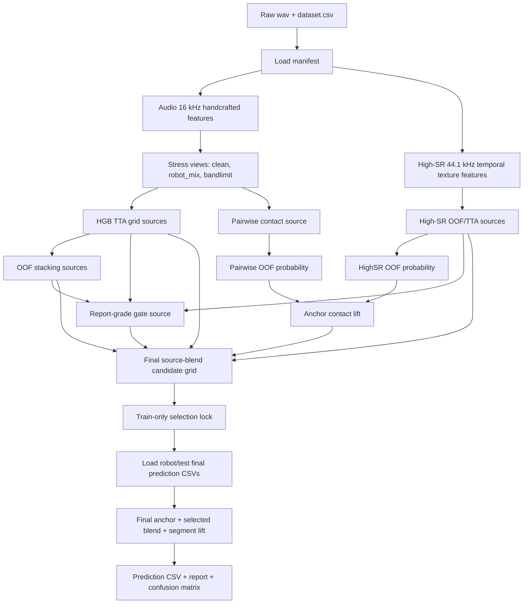
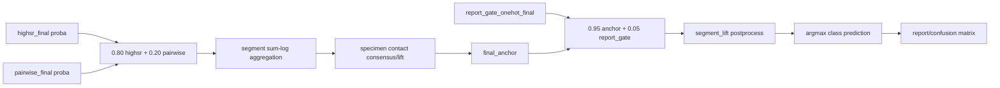

# Audio-Only Paper-Safe Reimplementation Guide

Ngày: 2026-07-06

Tài liệu này mô tả đầy đủ pipeline audio-only hiện tại đang được xem là bản
paper-safe/non-leaky tốt nhất trong workspace. Mục tiêu là để có thể đem sang
một máy khác và reproduce đúng kết quả hiện tại nhiều nhất có thể.

Bản checkpoint chính:

```text
checkpoints/audio_only_paper_safe_current_0702672_20260706
```

Script cuối cùng:

```text
train_audio_lift_source_blend_select_final_test.py
```

Run slug cuối:

```text
audio_lift_source_blend_select
```

## Kết Quả Cuối

Split đánh giá cuối: `robot_test_final`

| Metric | Value |
| --- | ---: |
| 4-class macro F1 | `0.7026719927789447` |
| 4-class accuracy | `0.7967552951780081` |
| 4-class macro precision | `0.7708012867550473` |
| 4-class macro recall | `0.7216816125387786` |
| weighted F1 | `0.7747472341134756` |
| contact macro F1, chỉ tính leaf/trunk/twig | `0.625050260344378` |
| binary ambient/contact macro F1 | `0.9291164642187257` |

Per-class final F1:

| Class | Precision | Recall | F1 | Support |
| --- | ---: | ---: | ---: | ---: |
| ambient | `0.8788819875776398` | `1.0` | `0.9355371900826446` | `1132` |
| leaf | `0.6579572446555819` | `0.9453924914675768` | `0.7759103641456583` | `293` |
| trunk | `0.9761904761904762` | `0.3557483731019523` | `0.5214626391096979` | `461` |
| twig | `0.5701754385964912` | `0.5855855855855856` | `0.5777777777777777` | `333` |

Confusion matrix:

| true \ pred | ambient | leaf | trunk | twig |
| --- | ---: | ---: | ---: | ---: |
| ambient | 1132 | 0 | 0 | 0 |
| leaf | 2 | 277 | 0 | 14 |
| trunk | 126 | 38 | 164 | 133 |
| twig | 28 | 106 | 4 | 195 |

## Ranh Giới Leakage

Pipeline này là audio-only paper-safe. Không dùng nhánh filename-prior hay bất
kỳ cách parse nhãn từ tên file.

Được phép dùng:

- Label của hand/default train.
- OOF probability tạo từ hand/default train.
- `group_key` lấy từ cấu trúc filename để gom các window thuộc cùng một audio
  segment.
- `specimen_group_key` lấy từ cấu trúc filename để ép consistency giữa các
  segment của cùng một specimen.
- Robot/test audio chỉ được dùng sau khi đã ghi lock chọn model bằng train-only
  selection.

Không được dùng:

- Robot/test label trong lúc chọn model, chọn blend, chọn weight, chọn
  threshold.
- Robot/test probability trong lúc chọn model.
- Image feature.
- Multimodal feature.
- Deep learning.
- Unsupervised adaptation trên robot/test.
- Parse các chữ như `leaf`, `trunk`, `twig`, `ambient`, `contact` từ filename
  rồi biến thành prediction.

Điểm quan trọng: final inference có dùng equality/grouping từ filename, nhưng
không dùng class word trong filename. Khi viết paper/report, mô tả đây là
group-consistency inference, không phải independent-window inference.

## Hai Chế Độ Reproduce

### Mode A: Frozen Artifact Replay

Dùng mode này nếu muốn ra đúng số hiện tại nhất. Copy toàn bộ repo, dataset,
`outputs/`, và `checkpoints/` sang máy mới, sau đó chạy lại script cuối.

Mode này không rebuild toàn bộ upstream model. Nó reuse các artifact đã lock:
OOF probability, final prediction CSV, source selection lock, rồi recompute
final blend/report. Đây là cách nên dùng nếu mục tiêu là reproduce đúng
`macro_f1_4class = 0.7026719927789447`.

### Mode B: Full Rebuild From Raw Audio

Dùng mode này nếu muốn dựng lại từ raw `.wav`. Phải chạy lại toàn bộ feature
cache, OOF source, stacker, high-SR source, pairwise source, report gate,
specimen lift, rồi mới chạy final blend.

Mode này có thể lệch rất nhỏ giữa máy vì:

- `HistGradientBoostingClassifier`.
- `ExtraTreesClassifier`.
- `LightGBM`.
- `XGBoost`.
- `SVC(probability=True)`.
- BLAS/OpenMP/thread scheduling.
- Version package khác nhau.

Nếu cần số cuối giống tuyệt đối, dùng Mode A.

## Environment

Môi trường hiện tại dùng để kiểm tra guide:

| Package | Version |
| --- | --- |
| Python | `3.10.12` |
| numpy | `1.26.4` |
| pandas | `2.2.3` |
| scikit-learn | `1.5.2` |
| librosa | `0.11.0` |
| soundfile | `0.13.1` |
| joblib | `1.5.3` |
| lightgbm | `4.6.0` |
| xgboost | `3.2.0` |
| scipy | `1.13.1` |

Cài môi trường:

```bash
python3 -m venv .venv
source .venv/bin/activate
python -m pip install --upgrade pip
python -m pip install \
  numpy==1.26.4 \
  pandas==2.2.3 \
  scikit-learn==1.5.2 \
  librosa==0.11.0 \
  soundfile==0.13.1 \
  joblib==1.5.3 \
  lightgbm==4.6.0 \
  xgboost==3.2.0 \
  scipy==1.13.1 \
  tqdm
```

Để giảm sai khác do multi-thread:

```bash
export PYTHONHASHSEED=0
export OMP_NUM_THREADS=1
export OPENBLAS_NUM_THREADS=1
export MKL_NUM_THREADS=1
export NUMEXPR_NUM_THREADS=1
```

High-SR script cũng nên set:

```bash
export MPLCONFIGDIR=/tmp/matplotlib
export NUMBA_CACHE_DIR=/tmp/numba_cache
```

## Dataset Layout

Repo hiện tại có symlink:

```text
tree_structures -> /home/ttung05/Desktop/tree_base/tree_structures
```

Trên máy mới, dataset root cần có dạng:

```text
tree_structures/
  audio_visual_dataset_default/
    dataset.csv
    audio/
      *.wav
  audio_visual_dataset_robo_default/
    dataset.csv
    audio/
      *.wav
```

`dataset.csv` cần ít nhất các cột:

| Column | Ý nghĩa |
| --- | --- |
| `audio_file` | đường dẫn tương đối từ thư mục dataset đến file `.wav` |
| `image_file` | có thể tồn tại nhưng pipeline audio-only bỏ qua |
| `category` | nhãn: `ambient`, `leaf`, `trunk`, `twig` |

Class map cố định:

| Label | ID |
| --- | ---: |
| ambient | 0 |
| leaf | 1 |
| trunk | 2 |
| twig | 3 |

Số mẫu quan sát được:

| Split | ambient | leaf | trunk | twig | total |
| --- | ---: | ---: | ---: | ---: | ---: |
| hand/default train | 5966 | 1670 | 1476 | 1564 | 10676 |
| robot/test final | 1132 | 293 | 461 | 333 | 2219 |

Manifest loading:

1. Đọc `dataset.csv`.
2. Lowercase `category`.
3. Bỏ row có label không thuộc class map.
4. Tạo `audio_path = csv_directory / audio_file`.
5. Require tất cả audio path tồn tại.
6. Gán `source = hand_train` hoặc `source = robot_test`.
7. Gán integer label `y`.
8. Gán `group_key` bằng `segment_group_key(audio_file)`.

`group_key`:

```python
stem = Path(audio_file).stem
group_key = re.sub(r"_window_\d+.*$", "", stem)
```

`specimen_group_key`:

```python
stem = Path(audio_file).stem
specimen = re.sub(r"_segment_.*$", "", stem)
```

Các key này chỉ dùng để biết các window/segment nào thuộc cùng group. Không
dùng từ class trong filename làm nhãn.

## Diagram Tổng Thể



## Pipeline 16 kHz

Định nghĩa chính nằm trong:

```text
train_val_select_final_test.py
```

Global audio config:

| Parameter | Value |
| --- | --- |
| sample rate | `16000` |
| duration | `1.0` second |
| target length | `16000` samples |
| normalization | peak normalization |
| top-energy crop length | `0.4` second |
| top-energy hop | `0.05` second |

Audio loading:

```python
signal, _ = librosa.load(path, sr=16000, mono=True)
signal = pad_or_truncate(signal, 16000)
signal = signal / (max(abs(signal)) + 1e-8)
```

Feature families:

| Feature set | Dimension | Thành phần |
| --- | ---: | --- |
| `mfcc40` | 40 | 20 MFCC means + 20 MFCC stds |
| `stft28` | 28 | RMS, ZCR, centroid, bandwidth, rolloff, flatness, flux; mỗi loại mean/std/max/p90 |
| `mel28` | 28 | 64-mel log spectrogram chia 7 groups; mỗi group mean/std/max/p90 |
| `fft24` | 24 | 8 band powers, 8 log band powers, 4 ratios, entropy/centroid/dominant frequency/dominant magnitude |
| `total120` | 120 | `mfcc40 + stft28 + mel28 + fft24` trên full 1s |
| `total240` | 240 | `total120(full 1s) + total120(top-energy 0.4s)` |

MFCC/STFT/Mel parameters:

| Parameter | Value |
| --- | --- |
| `n_fft` | `512` |
| `win_length` | `400` |
| `hop_length` | `160` |
| window | `hann` |
| MFCC count | `20` |
| MFCC mel bins | `64` |
| mel bins | `64` |
| mel groups | `7` |
| `fmin` | `20` |
| `fmax` | `8000` |

FFT bands:

```text
(20,100), (100,250), (250,500), (500,1000),
(1000,2000), (2000,4000), (4000,6000), (6000,8000)
```

Ở final script, cache `total240` được load để lấy `y` và alignment:

```python
base.configure_feature_set("total240")
base.build_or_load_feature_cache(
    train_df,
    "hand_train_full",
    feature_dir=Path("outputs/audio_feature_benchmarks/total240_trainval_select/features"),
    force_rebuild=False,
)
```

Đoạn này không train model mới ở final stage.

## Stress Views

Định nghĩa trong:

```text
train_stress_cv_select_final_test.py
```

Stress views cố định:

```python
STRESS_VIEWS = ("clean", "robot_mix", "bandlimit")
```

`clean`:

- Không perturb.

`robot_mix`:

1. FFT bandlimit `90..5200 Hz`.
2. Nhân amplitude với `Uniform(0.65, 1.25)`.
3. Thêm Gaussian noise với SNR `Uniform(18, 28) dB`.
4. Tanh drive với `drive = Uniform(1.15, 1.65)`.
5. Time roll integer shift `[-1200, 1200]`.
6. Peak normalize.

`bandlimit`:

1. FFT bandlimit `180..3600 Hz`.
2. Nhân amplitude với `Uniform(0.75, 1.15)`.
3. Clip vào `[-0.78, 0.78]`.
4. Thêm Gaussian noise với SNR `Uniform(24, 34) dB`.
5. Peak normalize.

Seed deterministic theo file và view:

```python
seed = sha256(f"{view}|{audio_path}").hexdigest()[:16] mod 2**32
```

## Pipeline High-SR 44.1 kHz

Định nghĩa trong:

```text
train_audio_highsr_temporal_tta_select_final_test.py
```

High-SR global config:

| Parameter | Value |
| --- | --- |
| target sample rate | `44100` |
| target length | `44100` samples |
| feature family | `audio_highsr_temporal_texture_v1` |
| stress views | `clean`, `robot_mix`, `bandlimit` |

Audio loading:

1. Đọc bằng `soundfile`.
2. Nếu stereo, convert mono bằng trung bình 2 kênh.
3. Resample về `44100` nếu cần.
4. Pad/truncate về 1 second.

Texture extraction:

| Parameter | Value |
| --- | --- |
| STFT/Mel `n_fft` | `2048` |
| hop | `441` |
| window | `1764` |
| mel bins | `96` |
| mel `fmin` | `20` |
| mel `fmax` | `sr/2` |
| MFCC count | `32` |
| top-energy window | `0.45` second |
| top-energy hop | `0.025` second |

High-SR source dùng cho final anchor:

| Field | Value |
| --- | --- |
| run | `audio_highsr_temporal_tta_select` |
| selected candidate | `highsr_hgb_default__all_aug` |
| selected train views | `clean`, `robot_mix`, `bandlimit` |
| TTA recipe | `w_c03_r02` |
| TTA weights | `{"clean": 0.6, "robot_mix": 0.4}` |
| selected class bias | `[0.2, 0.0, 0.0, 0.0]` |
| OOF macro F1 | `0.826843331579334` |

`highsr_hgb_default`:

```python
HistGradientBoostingClassifier(
    max_iter=260,
    learning_rate=0.045,
    max_leaf_nodes=31,
    min_samples_leaf=20,
    l2_regularization=0.02,
    class_weight={0: 0.5, 1: 1.2, 2: 1.8, 3: 1.4},
    random_state=42,
)
```

Các high-SR source khác được final loader xem như blend candidate:

| Source name | Run | Selected candidate | TTA weights | Bias |
| --- | --- | --- | --- | --- |
| `highsr_default` | `audio_highsr_temporal_tta_select` | `highsr_hgb_default__all_aug` | `clean=0.6, robot_mix=0.4` | `[0.2,0,0,0]` |
| `highsr_regularized` | `audio_highsr_temporal_hgb_regularized_select` | `highsr_hgb_regularized__all_aug` | `clean=0.6, robot_mix=0.4` | `[0.2,0,0,0]` |
| `highsr_extratrees` | `audio_highsr_temporal_extratrees_select` | `highsr_extratrees__all_aug` | `clean=0.4, robot_mix=0.4, bandlimit=0.2` | `[0,0,-0.2,0]` |

## Model Classical Chính

Định nghĩa candidate model trong:

```text
train_cv_select_final_test.py
```

Class weights common:

```python
{0: 0.6, 1: 1.1, 2: 1.8, 3: 1.3}
```

Direct candidates chính:

```python
direct_hgb_default = HistGradientBoostingClassifier(
    max_iter=300,
    learning_rate=0.05,
    max_leaf_nodes=31,
    class_weight={0:0.6,1:1.1,2:1.8,3:1.3},
    random_state=42,
)

direct_hgb_regularized = HistGradientBoostingClassifier(
    max_iter=360,
    learning_rate=0.035,
    max_leaf_nodes=15,
    min_samples_leaf=25,
    l2_regularization=0.08,
    class_weight={0:0.6,1:1.1,2:1.8,3:1.3},
    random_state=42,
)

direct_extra_trees = ExtraTreesClassifier(
    n_estimators=900,
    max_features="sqrt",
    min_samples_leaf=2,
    class_weight={0:0.6,1:1.1,2:1.8,3:1.3},
    random_state=42,
    n_jobs=-1,
)
```

HGB TTA grid source được chọn:

| Field | Value |
| --- | --- |
| run | `audio_tta_grid_hgb_select` |
| selected model | `grid_hgb_default__all_aug__w_c04_r04_b02__robust_bias` |
| base candidate | `grid_hgb_default__all_aug` |
| base model | `direct_hgb_default` |
| train views | `clean`, `robot_mix`, `bandlimit` |
| TTA weights | `clean=0.4, robot_mix=0.4, bandlimit=0.2` |
| class bias | `[0.0, 0.0, 0.0, 0.0]` |
| OOF macro F1 | `0.7943317573570801` |

## Pairwise Contact Source

Định nghĩa trong:

```text
train_audio_pairwise_contact_stress_cv_select_final_test.py
```

Selected pairwise model:

| Field | Value |
| --- | --- |
| run | `audio_pairwise_contact_stress_cv_select` |
| selected candidate | `pairwise_hgb_svm_all_aug` |
| selected bias variant | `tuned_balanced_contact_score` |
| selected bias | `[0.0, -0.6, -1.2, -0.6]` |
| train views | `clean`, `robot_mix`, `bandlimit` |

Pairwise architecture:

1. Train binary model cho ambient/contact.
2. Train 3 model pairwise trong contact class:
   - leaf vs trunk
   - leaf vs twig
   - trunk vs twig
3. Convert pairwise votes thành contact class probabilities.
4. Nhân contact class probabilities với binary contact probability.

Factories chính:

```python
binary_hgb = HistGradientBoostingClassifier(
    max_iter=260,
    learning_rate=0.05,
    max_leaf_nodes=15,
    min_samples_leaf=25,
    l2_regularization=0.05,
    class_weight="balanced",
    random_state=42,
)

pair_svm = Pipeline([
    ("scale", StandardScaler()),
    ("model", SVC(
        kernel="rbf",
        C=5.0,
        gamma="scale",
        class_weight="balanced",
        probability=True,
        random_state=42,
    )),
])
```

Pairwise OOF cache final script dùng:

```text
outputs/audio_feature_benchmarks/audio_log_consensus_pair_blend_select/
  oof_sources/pairwise_selected_clean_oof_proba.npy
```

Fallback:

```text
outputs/audio_feature_benchmarks/audio_group_consistency_pair_blend_select/
  oof_sources/pairwise_selected_clean_oof_proba.npy
```

## Report-Grade Gate Source

Định nghĩa trong:

```text
train_audio_report_grade_gate_select_final_test.py
```

Final selected source blend dùng `report_gate_onehot`, nên source này quan
trọng dù standalone robot/test macro F1 thấp hơn final blend.

Fixed gate settings:

| Parameter | Value |
| --- | --- |
| binary source | `total240_ensemble` |
| gate source | `total240_tree_meta` |
| probability gamma | `2.0` |
| class bias | `[0.0, 0.2, 0.0, 0.2]` |
| gate threshold candidates | `0.85`, `0.90` |

Selected OOF recipe:

| Field | Value |
| --- | --- |
| blend name | `highsr65_simple` |
| contact class weights | `total240_ensemble=0.25`, `total240_stack_lr=0.10`, `highsr_hgb=0.65` |
| force contact threshold | `0.90` |
| OOF macro F1 | `0.8311854356863949` |
| OOF contact macro F1 | `0.7779505488773051` |
| OOF binary macro F1 | `0.9896391462777763` |

Report-gate formula:

```python
class_proba = blend_sources(source_proba, class_weights)
base_proba = hierarchical_contact_blend(total240_ensemble, class_proba)
pred = predict_with_bias(calibrate_proba(base_proba, gamma=2.0), [0,0.2,0,0.2])
gate_signal = sum(normalize(total240_tree_meta)[:, 1:4], axis=1)
contact_pred = 1 + argmax(normalize(class_proba)[:, 1:4])
force_mask = (pred == 0) & (gate_signal >= 0.90)
pred[force_mask] = contact_pred[force_mask]
report_gate_onehot = one_hot(pred)
```

## OOF Stacking Sources

Định nghĩa trong:

```text
train_audio_oof_stacking_select_final_test.py
```

`total240_stack_lr` selected lock:

| Field | Value |
| --- | --- |
| run | `audio_oof_stacking_select` |
| model | `top4_tta__logreg_C0.1_cwbalanced` |
| stack spec | `top4_tta` |
| top_k | `4` |
| include views | `false` |
| include confidence | `true` |
| meta model | `LogisticRegression(C=0.1, class_weight="balanced", max_iter=2000, solver="lbfgs")` |
| n stack features | `44` |
| probability gamma | `0.85` |
| class bias | `[0.2, 0.0, 0.0, 0.0]` |

`total240_tree_meta` selected lock:

| Field | Value |
| --- | --- |
| run | `audio_oof_stacking_tree_meta_select` |
| model | `top4_tta_views__extratrees_leaf8_mfsqrt` |
| stack spec | `top4_tta_views` |
| top_k | `4` |
| include views | `true` |
| include confidence | `true` |
| meta model | `ExtraTreesClassifier(n_estimators=500, min_samples_leaf=8, max_features="sqrt", class_weight="balanced")` |
| n stack features | `176` |
| probability gamma | `0.85` |
| class bias | `[0.2, 0.0, 0.0, 0.0]` |

Top HGB/TTA members:

| Member | TTA weights |
| --- | --- |
| `grid_hgb_default__all_aug__w_c05_r05__robust_bias` | `clean=0.5, robot_mix=0.5` |
| `grid_hgb_default__all_aug__w_c04_r04_b02__robust_bias` | `clean=0.4, robot_mix=0.4, bandlimit=0.2` |
| `grid_hgb_default__all_aug__w_c04_r06__robust_bias` | `clean=0.4, robot_mix=0.6` |
| `grid_hgb_default__all_aug__w_c05_r04_b01__robust_bias` | `clean=0.5, robot_mix=0.4, bandlimit=0.1` |

## Final Source List

Final script load train OOF source probabilities qua `broad.load_train_sources()`:

| Source name | Origin |
| --- | --- |
| `total240_grid` | `audio_tta_grid_hgb_select` OOF |
| `total240_ensemble` | `audio_tta_grid_hgb_ensemble_select` OOF |
| `total240_stack_lr` | `audio_oof_stacking_select` OOF/meta |
| `total240_tree_meta` | `audio_oof_stacking_tree_meta_select` OOF/meta |
| `total120_grid` | `audio_total120_tta_grid_hgb_select` OOF |
| `mfcc40_grid` | `audio_mfcc40_tta_grid_hgb_select` OOF |
| `highsr_default` | `audio_highsr_temporal_tta_select` OOF |
| `highsr_regularized` | `audio_highsr_temporal_hgb_regularized_select` OOF |
| `highsr_extratrees` | `audio_highsr_temporal_extratrees_select` OOF |
| `report_gate_proba` | soft probabilities từ report-grade gate |
| `report_gate_onehot` | one-hot predictions từ report-grade gate |

Final robot/test evaluation load các final prediction CSV đã align:

```text
outputs/audio_feature_benchmarks/audio_tta_grid_hgb_select/reports/audio_tta_grid_hgb_select_final_test_predictions.csv
outputs/audio_feature_benchmarks/audio_tta_grid_hgb_ensemble_select/reports/audio_tta_grid_hgb_ensemble_select_final_test_predictions.csv
outputs/audio_feature_benchmarks/audio_oof_stacking_select/reports/audio_oof_stacking_select_final_test_predictions.csv
outputs/audio_feature_benchmarks/audio_oof_stacking_tree_meta_select/reports/audio_oof_stacking_tree_meta_select_final_test_predictions.csv
outputs/audio_feature_benchmarks/audio_total120_tta_grid_hgb_select/reports/audio_total120_tta_grid_hgb_select_final_test_predictions.csv
outputs/audio_feature_benchmarks/audio_mfcc40_tta_grid_hgb_select/reports/audio_mfcc40_tta_grid_hgb_select_final_test_predictions.csv
outputs/audio_feature_benchmarks/audio_highsr_temporal_tta_select/reports/audio_highsr_temporal_tta_select_final_test_predictions.csv
outputs/audio_feature_benchmarks/audio_highsr_temporal_hgb_regularized_select/reports/audio_highsr_temporal_hgb_regularized_select_final_test_predictions.csv
outputs/audio_feature_benchmarks/audio_highsr_temporal_extratrees_select/reports/audio_highsr_temporal_extratrees_select_final_test_predictions.csv
outputs/audio_feature_benchmarks/audio_report_grade_gate_select/reports/audio_report_grade_gate_select_final_test_predictions.csv
```

Invariant bắt buộc:

```python
audio_file order must match across all final source CSVs
y order must match across all final source CSVs
```

Nếu order lệch, kết quả blend sẽ sai ngay cả khi từng source riêng lẻ đúng.

## Thuật Toán Cuối

Final algorithm có 3 lớp:

1. Build anchor probability từ high-SR và pairwise source.
2. Evaluate train-only blend candidates trên các audio source đã lock.
3. Apply selected source/weight/mode lên robot/test.

### Probability Normalization

Mọi probability matrix được normalize:

```python
proba = clip(proba, 1e-12, None or 1.0)
proba = proba / proba.sum(axis=1, keepdims=True)
```

### Segment Probability

Mỗi `group_key` gom nhiều window. Segment probability được tính bằng tổng log
probability:

```python
values = log(clip(window_proba, 1e-12, 1.0))
sums[group, class] = sum(values[windows_in_group, class])
segment_proba = softmax(sums per group)
```

Sau đó map ngược từ segment rows về window rows bằng `window_to_segment`.

### Specimen Contact Consensus And Lift

Selected lift parameters:

| Parameter | Value |
| --- | ---: |
| consensus threshold | `0.45` |
| min contact segments | `1` |
| lift min mass | `0.35` |
| lift floor | `0.58` |
| lift confidence | `0.45` |

Algorithm:

```python
output = normalize(segment_proba)
contact_mass = output[:, 1:4].sum(axis=1)
contact_dist = normalize(output[:, 1:4])

for specimen in unique(specimen_codes):
    group_idx = segment rows for this specimen
    contact_idx = group_idx where contact_mass >= 0.45
    if len(contact_idx) < 1:
        continue

    consensus = normalize(mean(contact_dist[contact_idx], axis=0))

    # Giữ nguyên ambient/contact mass của từng segment.
    output[group_idx, 1:4] = contact_mass[group_idx, None] * consensus
    output[group_idx, 0] = 1.0 - contact_mass[group_idx]

    if max(consensus) < 0.45:
        continue

    pred_before = argmax(output[group_idx], axis=1)
    lift_mask = (pred_before == ambient) & (contact_mass[group_idx] >= 0.35)
    lifted_mass = max(contact_mass[lift_idx], 0.58)
    lifted_mass = clip(lifted_mass, 1e-12, 0.98)
    output[lift_idx, 0] = 1.0 - lifted_mass
    output[lift_idx, 1:4] = lifted_mass[:, None] * consensus
```

### Anchor Probability

Anchor formula:

```python
window = normalize(0.80 * highsr_proba + 0.20 * pairwise_proba)
segment = segment_proba_from_window(frame, window)
segment = consensus_and_lift(
    segment,
    specimen_codes,
    consensus_threshold=0.45,
    min_contact_segments=1,
    lift_min_mass=0.35,
    lift_floor=0.58,
    lift_confidence=0.45,
)
anchor = normalize(segment[window_to_segment])
```

Anchor này khớp configuration `audio_specimen_contact_lift`:

| Field | Value |
| --- | --- |
| high-SR weight | `0.80` |
| pairwise weight | `0.20` |
| segment rule | `sum_log_proba` |
| specimen rule | `contact_subclass_consensus` |
| consensus alpha | `1.0` |
| lift rule | `ambient_contact_mass_floor` |

### Candidate Grid

Final source weights:

```python
SOURCE_WEIGHTS = [0.0, 0.05, 0.10, 0.15, 0.20, 0.25, 0.33, 0.50]
```

Final blend modes:

```python
BLEND_MODES = ["raw_argmax", "segment_lift"]
```

Candidate generation:

```python
source_items = [("anchor_only", None)] + sorted(train_sources.items())

for source_name, source_proba in source_items:
    for source_weight in SOURCE_WEIGHTS:
        if source_name == "anchor_only" and source_weight > 0:
            skip
        if source_name != "anchor_only" and source_weight <= 0:
            skip

        if source_name == "anchor_only":
            blended = anchor
        else:
            blended = normalize((1 - source_weight) * anchor + source_weight * source_proba)

        for blend_mode in ["raw_argmax", "segment_lift"]:
            final_proba = postprocess(frame, blended, blend_mode)
            pred = argmax(final_proba)
            score candidate on train OOF labels
```

Candidate count:

```text
anchor_only: 1 weight * 2 modes = 2
11 sources: 7 positive weights * 2 modes * 11 = 154
total = 156
```

Selection metrics:

```python
macro = macro_f1(y, pred, labels=[0,1,2,3])
contact = macro_f1(y, pred, labels=[1,2,3])
binary = macro_f1(y > 0, pred > 0, labels=[0,1])
selection_score = 0.60 * macro + 0.30 * contact + 0.10 * binary
```

Selected train-only candidate:

| Field | Value |
| --- | --- |
| recipe kind | `audio_lift_source_blend` |
| source name | `report_gate_onehot` |
| source weight | `0.05` |
| blend mode | `segment_lift` |
| OOF macro F1 | `0.9353447727801658` |
| OOF contact macro F1 | `0.9164944534943943` |
| OOF binary macro F1 | `0.99077894279929` |
| selection score | `0.9352330939963467` |

### Final Robot/Test Formula

Selected candidate chỉ được apply sau khi đã ghi:

```text
audio_lift_source_blend_select_selected_without_test.json
audio_lift_source_blend_select_method_card_before_test.json
```

Final formula:

```python
final_anchor = anchor_lift_proba(test_frame, highsr_final, pair_final)
final_blended = normalize(0.95 * final_anchor + 0.05 * report_gate_onehot_final)
final_proba = postprocess(test_frame, final_blended, "segment_lift")
final_pred = argmax(final_proba, axis=1)
```

`segment_lift` dùng lại segment log aggregation và specimen consensus/lift ở
trên.

Final inference diagram:



## Artifact Outputs

Final script ghi:

```text
outputs/audio_feature_benchmarks/audio_lift_source_blend_select/
  reports/
    audio_lift_source_blend_select_method_card_before_test.json
    audio_lift_source_blend_select_selected_without_test.json
    audio_lift_source_blend_select_oof_leaderboard.csv
    audio_lift_source_blend_select_final_test_report.csv
    audio_lift_source_blend_select_final_test_predictions.csv
    audio_lift_source_blend_select_final_test_confusion_matrix.csv
    audio_lift_source_blend_select_protocol_summary.json
  models/
    audio_lift_source_blend_select_selected_model_bundle.joblib
```

Frozen checkpoint copy chứa:

```text
checkpoints/audio_only_paper_safe_current_0702672_20260706/
  README.md
  MANIFEST.md
  SHA256SUMS.txt
  train_audio_lift_source_blend_select_final_test.py
  train_audio_report_grade_gate_select_final_test.py
  train_audio_log_consensus_pair_blend_select_final_test.py
  AUDIO_ONLY_REPORT_GRADE_PROTOCOL.md
  audio_lift_source_blend_select_method_card_before_test.json
  audio_lift_source_blend_select_selected_without_test.json
  audio_lift_source_blend_select_oof_leaderboard.csv
  audio_lift_source_blend_select_final_test_report.csv
  audio_lift_source_blend_select_final_test_confusion_matrix.csv
  audio_lift_source_blend_select_protocol_summary.json
```

Verify checkpoint từ repo root:

```bash
sha256sum -c checkpoints/audio_only_paper_safe_current_0702672_20260706/SHA256SUMS.txt
```

## Lệnh Frozen Replay

Từ repo root:

```bash
python3 train_audio_lift_source_blend_select_final_test.py \
  --root /home/ttung05/Desktop/tree_base/tree_structures \
  --output outputs \
  --run-slug audio_lift_source_blend_select \
  --random-state 42
```

Nếu dùng symlink `tree_structures` trong repo:

```bash
python3 train_audio_lift_source_blend_select_final_test.py \
  --root tree_structures \
  --output outputs \
  --run-slug audio_lift_source_blend_select \
  --random-state 42
```

Expected terminal summary:

```text
model                   accuracy_4class  macro_f1_4class  contact_macro_f1  binary_macro_f1  selected_oof_macro_f1 selected_source_name selected_source_weight selected_blend_mode
audio_lift_source_blend 0.796755295178   0.702671992779   0.625050260344    0.929116464219   0.935344772780         report_gate_onehot   0.05                   segment_lift
```

## Lệnh Full Rebuild

Dùng khi `outputs/` bị thiếu hoặc muốn regenerate từ raw audio. Nên chạy từng
bước, sau mỗi bước kiểm tra `selected_without_test.json` trước khi chạy tiếp.

```bash
# 1. Base total240 feature cache và baseline đơn giản.
python3 train_val_select_final_test.py \
  --root tree_structures \
  --output outputs \
  --feature-set total240 \
  --random-state 42

# 2. Core total240 HGB TTA source.
python3 train_audio_tta_grid_hgb_select_final_test.py \
  --root tree_structures \
  --output outputs \
  --feature-set total240 \
  --random-state 42 \
  --n-folds 5 \
  --weight-step 10 \
  --selection-margin 0.0025

# 3. Total240 HGB TTA ensemble source.
python3 train_audio_tta_grid_ensemble_select_final_test.py \
  --root tree_structures \
  --output outputs \
  --feature-set total240 \
  --random-state 42

# 4. OOF stacking sources.
python3 train_audio_oof_stacking_select_final_test.py \
  --root tree_structures \
  --output outputs \
  --run-slug audio_oof_stacking_select \
  --random-state 42

python3 train_audio_oof_stacking_select_final_test.py \
  --root tree_structures \
  --output outputs \
  --run-slug audio_oof_stacking_tree_meta_select \
  --random-state 42

# 5. High-SR temporal source.
python3 train_audio_highsr_temporal_tta_select_final_test.py \
  --root tree_structures \
  --output outputs \
  --run-slug audio_highsr_temporal_tta_select \
  --random-state 42 \
  --n-folds 5 \
  --n-jobs 8

# 6. Additional high-SR selected-source runs.
python3 train_audio_highsr_temporal_tta_select_final_test.py \
  --root tree_structures \
  --output outputs \
  --run-slug audio_highsr_temporal_hgb_regularized_select \
  --random-state 42 \
  --n-folds 5 \
  --n-jobs 8

python3 train_audio_highsr_temporal_tta_select_final_test.py \
  --root tree_structures \
  --output outputs \
  --run-slug audio_highsr_temporal_extratrees_select \
  --random-state 42 \
  --n-folds 5 \
  --n-jobs 8

# 7. Total120 và MFCC40 HGB TTA grid sources.
python3 train_audio_tta_grid_hgb_select_final_test.py \
  --root tree_structures \
  --output outputs \
  --feature-set total120 \
  --run-slug audio_total120_tta_grid_hgb_select \
  --selection-margin 0.0 \
  --random-state 42

python3 train_audio_tta_grid_hgb_select_final_test.py \
  --root tree_structures \
  --output outputs \
  --feature-set mfcc40 \
  --run-slug audio_mfcc40_tta_grid_hgb_select \
  --selection-margin 0.0 \
  --random-state 42

# 8. Pairwise contact source và log-consensus pair blend.
python3 train_audio_pairwise_contact_stress_cv_select_final_test.py \
  --root tree_structures \
  --output outputs \
  --random-state 42 \
  --n-folds 5

python3 train_audio_log_consensus_pair_blend_select_final_test.py \
  --root tree_structures \
  --output outputs \
  --random-state 42

# 9. Report-grade gate source.
python3 train_audio_report_grade_gate_select_final_test.py \
  --root tree_structures \
  --output outputs \
  --random-state 42

# 10. Specimen consensus/lift, rồi final source blend.
python3 train_audio_specimen_contact_consensus_select_final_test.py \
  --root tree_structures \
  --output outputs

python3 train_audio_specimen_contact_lift_select_final_test.py \
  --root tree_structures \
  --output outputs

python3 train_audio_lift_source_blend_select_final_test.py \
  --root tree_structures \
  --output outputs \
  --run-slug audio_lift_source_blend_select \
  --random-state 42
```

Sau mỗi bước, kiểm tra:

```text
outputs/audio_feature_benchmarks/<run-slug>/reports/<run-slug>_selected_without_test.json
outputs/audio_feature_benchmarks/<run-slug>/reports/<run-slug>_final_test_report.csv
```

Final selection bắt buộc:

```json
{
  "source_name": "report_gate_onehot",
  "source_weight": 0.05,
  "blend_mode": "segment_lift",
  "macro_f1": 0.9353447727801658,
  "contact_macro_f1": 0.9164944534943943,
  "binary_macro_f1": 0.99077894279929,
  "selection_score": 0.9352330939963467
}
```

## Script Kiểm Chứng

Chạy sau khi reproduce:

```bash
python3 - <<'PY'
import pandas as pd
from pathlib import Path

report = Path("outputs/audio_feature_benchmarks/audio_lift_source_blend_select/reports/audio_lift_source_blend_select_final_test_report.csv")
cm = Path("outputs/audio_feature_benchmarks/audio_lift_source_blend_select/reports/audio_lift_source_blend_select_final_test_confusion_matrix.csv")

r = pd.read_csv(report).iloc[0]
checks = {
    "macro_f1_4class": 0.7026719927789447,
    "accuracy_4class": 0.7967552951780081,
    "contact_macro_f1": 0.625050260344378,
    "binary_macro_f1": 0.9291164642187257,
}

for key, expected in checks.items():
    actual = float(r[key])
    print(f"{key}: actual={actual:.16f} expected={expected:.16f} diff={abs(actual-expected):.3e}")

print()
print(cm.read_text())
PY
```

Expected confusion matrix:

```text
,ambient,leaf,trunk,twig
ambient,1132,0,0,0
leaf,2,277,0,14
trunk,126,38,164,133
twig,28,106,4,195
```

## Checklist Reimplement Trên Máy Khác

1. Copy repo code.
2. Copy raw dataset đúng layout.
3. Nếu cần exact number, copy cả `outputs/` và `checkpoints/`.
4. Tạo venv đúng package versions.
5. Set thread env vars.
6. Verify `tree_structures/.../dataset.csv` và audio files tồn tại.
7. Từ repo root, chạy `sha256sum -c checkpoints/audio_only_paper_safe_current_0702672_20260706/SHA256SUMS.txt`.
8. Chạy Frozen Replay command.
9. Chạy Verification Script.
10. Nếu metric lệch, kiểm tra alignment của final prediction CSVs trước.

## Lỗi Hay Gặp

1. Sai dataset root.

   Symptom: thiếu `dataset.csv` hoặc audio paths không tồn tại.

   Fix: truyền `--root /absolute/path/to/tree_structures` hoặc tạo lại symlink
   `tree_structures`.

2. Source frame misalignment.

   Symptom: assertion error về `audio_file` hoặc `y` không align.

   Fix: rebuild/copy toàn bộ upstream final prediction CSV từ cùng một run,
   không trộn artifact từ nhiều dataset/output khác nhau.

3. Thiếu pairwise OOF cache.

   Required path:

   ```text
   outputs/audio_feature_benchmarks/audio_log_consensus_pair_blend_select/oof_sources/pairwise_selected_clean_oof_proba.npy
   ```

   Fallback:

   ```text
   outputs/audio_feature_benchmarks/audio_group_consistency_pair_blend_select/oof_sources/pairwise_selected_clean_oof_proba.npy
   ```

4. Final selection khác `report_gate_onehot`.

   Symptom: `selected_without_test.json` có source/weight/blend mode khác.

   Fix: kiểm tra lại toàn bộ OOF artifacts và lock files. Final selector chỉ ổn
   định khi upstream OOF sources giống nhau.

5. Full rebuild metric hơi lệch.

   Cause: package versions, multi-threading, sklearn/LightGBM/XGBoost detail,
   hoặc feature cache metadata không giống.

   Fix: dùng Mode A để exact reproduction; nếu vẫn rebuild, pin versions và
   threads như ở trên.

## Source Of Truth

| Mục đích | File |
| --- | --- |
| final pipeline | `train_audio_lift_source_blend_select_final_test.py` |
| common feature extraction | `train_val_select_final_test.py` |
| segment/specimen consensus | `train_audio_specimen_contact_consensus_select_final_test.py` |
| contact lift | `train_audio_specimen_contact_lift_select_final_test.py` |
| final source loader | `train_audio_broad_oof_meta_select_final_test.py` |
| report-grade gate | `train_audio_report_grade_gate_select_final_test.py` |
| high-SR source | `train_audio_highsr_temporal_tta_select_final_test.py` |
| HGB TTA grid source | `train_audio_tta_grid_hgb_select_final_test.py` |
| pairwise contact source | `train_audio_pairwise_contact_stress_cv_select_final_test.py` |
| stress augmentation | `train_stress_cv_select_final_test.py` |
| frozen checkpoint | `checkpoints/audio_only_paper_safe_current_0702672_20260706/` |

## Minimal Pseudocode

```python
root = resolve_root()
train_df = load_manifest(root / "audio_visual_dataset_default" / "dataset.csv", "hand_train")
y = load_total240_cache(train_df)["y"]

fold_assignment = read_csv("outputs/.../audio_tta_grid_hgb_select/splits/hand_train_full_hgb_tta_grid_folds.csv")["cv_fold"]
train_sources = load_train_sources(outputs, y, fold_assignment, random_state=42)
highsr_oof = load_highsr_oof(outputs)
pairwise_oof = load_pairwise_oof(outputs)

anchor = anchor_lift_proba(train_df, highsr_oof, pairwise_oof)
leaderboard = []

for source_name, source_proba in [("anchor_only", None)] + sorted(train_sources.items()):
    for weight in [0, .05, .10, .15, .20, .25, .33, .50]:
        if invalid_weight_for_source(source_name, weight):
            continue

        if source_proba is None:
            blended = anchor
        else:
            blended = normalize((1 - weight) * anchor + weight * source_proba)

        for mode in ["raw_argmax", "segment_lift"]:
            proba = postprocess(train_df, blended, mode)
            pred = argmax(proba)
            leaderboard.append(score(pred, y, source_name, weight, mode))

selected = max_by(selection_score, macro_f1, contact_macro_f1, binary_macro_f1)
write_selection_lock_before_test(selected)

test_frame, final_sources = load_final_sources(outputs)
highsr_final = read_final_proba("audio_highsr_temporal_tta_select")
pair_final = read_final_proba("audio_pairwise_contact_stress_cv_select")
final_anchor = anchor_lift_proba(test_frame, highsr_final, pair_final)

final_blended = normalize(0.95 * final_anchor + 0.05 * final_sources["report_gate_onehot"])
final_proba = postprocess(test_frame, final_blended, "segment_lift")
final_pred = argmax(final_proba)
write_final_report(final_pred, test_frame["y"])
```
