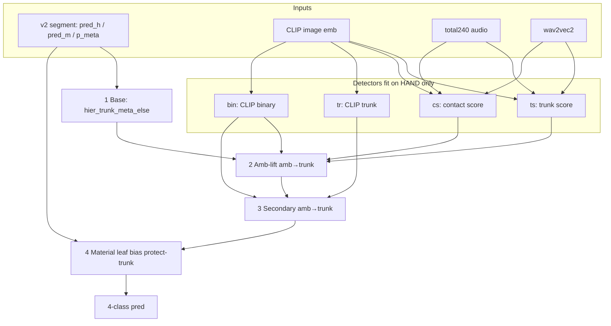

# Paper Claim v2 Fusion — Hướng dẫn triển khai chi tiết

Tài liệu mô tả **bản multimodal fusion ổn định để paper**:  
**`paper_claim_v2`** (simplified single-shot) + bản code gọn tương đương **`clear_pipeline`**.

| | |
|--|--|
| **Recipe ID** | `paper_claim_v2_simple_leaf_bias` |
| **Claim out** | `outputs/paper_claim_v2/` |
| **Seal** | `CLAIM_SEAL.json` (robot mở đúng **1 lần**) |
| **Robot Macro F1** | **0.850781** |
| **Robot Acc** | 0.891393 |
| **Binary Macro F1** | 0.965652 |
| **Free HP (hand)** | chỉ `b_leaf = −1.3` |
| **Code claim đầy đủ** | `run_paper_claim_v2_*.py` + `RECIPE_v2_simple.json` |
| **Code clear (cùng F1)** | `paper_claim/clear_pipeline.py` |

---

## Mục lục

1. [Tổng quan & phạm vi claim](#1-tổng-quan--phạm-vi-claim)
2. [Diagram kiến trúc](#2-diagram-kiến-trúc)
3. [Data requirements](#3-data-requirements)
4. [Feature / artifact prerequisites](#4-feature--artifact-prerequisites)
5. [Bốn bước inference (chi tiết)](#5-bốn-bước-inference-chi-tiết)
6. [Detectors (fit hand-only)](#6-detectors-fit-hand-only)
7. [Protocol selection & seal](#7-protocol-selection--seal)
8. [Hyperparameters đã lock](#8-hyperparameters-đã-lock)
9. [Kết quả sealed](#9-kết-quả-sealed)
10. [Cách chạy / verify](#10-cách-chạy--verify)
11. [Artifacts output](#11-artifacts-output)
12. [What was cut vs full stack](#12-what-was-cut-vs-full-stack)
13. [Leakage invariants & honesty](#13-leakage-invariants--honesty)
14. [Checklist triển khai từ đầu](#14-checklist-triển-khai-từ-đầu)
15. [File map](#15-file-map)

---

## 1. Tổng quan & phạm vi claim

### 1.1 Bài toán

Phân loại **4 lớp contact material** trên robot/test:

| Label | ID |
|-------|----|
| ambient | 0 |
| leaf | 1 |
| trunk | 2 |
| twig | 3 |

### 1.2 Fusion là gì (v2)

Không phải joint network train end-to-end. Đây là **cascade rule stack** trên:

1. **Audio segment base** (artifact v2: hard pred + soft meta)  
2. **Contact rescue** (amb → trunk) dùng detectors audio+image  
3. **Material redecode** leaf/twig với bias trên soft meta  

```
Audio segment stack (v2)
        +
Image CLIP (+ optional multi-bb in full claim path)
        +
Audio total240 / stress robot_mix + wav2vec2
        ↓
4-step cascade → 4-class prediction
```

### 1.3 Hai implementation tương đương F1

| Path | Mô tả | Robot F1 |
|------|--------|---------:|
| **Claim full** `run_paper_claim_v2_final_test_once.py` | Detectors multi-backbone + 2 stress views; protocol seal | 0.8508 |
| **Clear** `paper_claim/clear_pipeline.py` | CLIP ‖ w2v ‖ robot_mix only; cùng HP | **0.8508** (agree=1.0) |

**Viết paper / figure:** dùng clear architecture.  
**Số claim / seal:** `outputs/paper_claim_v2/`.

### 1.4 Không thuộc claim

- Mọi run `outputs/.../multimodal_085_*` exploratory (multi-peek robot)  
- `paper_claim_v1` (phức tạp hơn; F1 0.853 — không phải path v2)  
- Image-only / audio-only baselines  

---

## 2. Diagram kiến trúc

### 2.1 End-to-end (clear = paper figure)

```
                    ┌─────────────────────────────────────────┐
                    │           INPUTS (robot windows)         │
                    │  audio rows + images + precomputed feats │
                    └─────────────────────────────────────────┘
                         │              │              │
           ┌─────────────┘              │              └─────────────┐
           ▼                            ▼                            ▼
   ┌───────────────┐          ┌─────────────────┐          ┌────────────────┐
   │ v2 segment    │          │ CLIP emb (768)  │          │ total240 (240) │
   │ base artifact │          │ + wav2vec2      │          │ (clean robot)  │
   │ pred_h,pred_m │          │ (pool→segment)  │          │ + w2v pool     │
   │ p_meta (N,4)  │          └────────┬────────┘          └───────┬────────┘
   └───────┬───────┘                   │                           │
           │                           └─────────────┬─────────────┘
           ▼                                         ▼
   [1] BASE                                   Detectors (hand-fit)
   pred = pred_h if trunk else pred_m         ts, cs, tr, bin
           │                                         │
           ▼                                         │
   [2] AMB-LIFT  ◄───────────────────────────────────┤
   if pred==ambient                                  │
      and ts≥0.5 and max(cs,bin)≥0.1                 │
      → pred := trunk                                │
           │                                         │
           ▼                                         │
   [3] SECONDARY  ◄──────────────────────────────────┘
   if pred==ambient
      and tr≥0.625 and bin≥0.75
      → pred := trunk
           │
           ▼
   [4] MATERIAL (protect trunk)
   if pred ∈ {leaf, twig}:
      logits = log(meta[1:4]) + [b_leaf, 0, 0]
      pred = 1 + argmax(logits)
           │
           ▼
   expand segment → window rows
           │
           ▼
   4-class labels  (Macro F1 = 0.8508)
```

### 2.2 Mermaid



### 2.3 ASCII slide

```
  audio ──total240──┐
  audio ──wav2vec2──┼──▶ amb detectors ──┐
  image ──CLIP──────┘                    │
                                         ▼
  v2 base ──▶ [amb-lift] ──▶ [secondary] ──▶ [leaf bias] ──▶ label
              amb→trunk      amb→trunk        leaf/twig only
```

### 2.4 Protocol (selection ≠ test)

```
RECIPE_v2_simple.json (frozen, SHA-256)
        │
        ▼
hand selection only  →  selection_lock.json   (test_loaded: false)
        │                     b_leaf = −1.3
        ▼
robot open ONCE      →  final_test_metrics.json + CLAIM_SEAL.json
        │
        ▼
second open REFUSED (unless PAPER_CLAIM_FORCE_REOPEN=1 diagnostic)
```

---

## 3. Data requirements

### 3.1 Dataset root

```
tree_structures/   # default: /home/ttung05/Desktop/tree_base/tree_structures
├── audio_visual_dataset_default/          # HAND — selection + fit detectors
│   ├── dataset.csv
│   ├── audio/...
│   └── images/...
└── audio_visual_dataset_robo_default/     # ROBOT — final test only (after lock)
    ├── dataset.csv
    ├── audio/...
    └── images/...
```

### 3.2 `dataset.csv` (mỗi split)

| Cột | Bắt buộc | Ghi chú |
|-----|----------|---------|
| `audio_file` | Có | Identity + segment/specimen grouping |
| `image_file` | Có (cho image feats) | Path relative tới dataset dir |
| `category` | Có | `ambient` / `leaf` / `trunk` / `twig` |

Ví dụ:

```csv
audio_file,image_file,category
audio/letwig1.4_segment_0_window_0_ambient.wav,images/letwig1.4_segment_0_window_0_ambient.jpg,ambient
```

### 3.3 Quy mô (pipeline hiện tại)

| Split | Windows (rows) | Vai trò |
|-------|---------------:|---------|
| Hand | 10 676 | Fit detectors; hand selection `b_leaf` |
| Robot | 2 219 | Claim test (một lần) |

Segment robot trong v2 base artifact: **264 segments** (pool từ 2219 windows).

### 3.4 Group keys (anti-leak)

| Key | Định nghĩa |
|-----|------------|
| `segment_group` | stem bỏ `_window_*` |
| `specimen_group` | stem bỏ `_segment_*` (và window) |

**Cấm:** parse token class (`leaf`/`trunk`/…) từ filename làm feature.

### 3.5 Label purity

- Hand selection / detector fit: **chỉ** labels hand.  
- Robot labels: **chỉ** dùng sau lock, để tính metrics (không tune HP).

---

## 4. Feature / artifact prerequisites

Pipeline **không** train lại backbone trong claim path. Cần **precomputed caches**:

### 4.1 Bảng artifacts bắt buộc (clear path)

| Artifact | Path | Shape (hand / robot) | Dùng cho |
|----------|------|----------------------|----------|
| **v2 segment base** | `outputs/audio_feature_benchmarks/segment_rule_stack_v2_group_selection/segment_rule_stack_v2_base_segment_outputs.npz` | 264 segs (robot) | Base pred + meta soft |
| **CLIP emb** | `outputs/image_timm_features/vit_base_patch16_clip_224.openai_ft_in1k/{hand_train_full,robot_test}/X.npy` | (10676, 768) / (2219, 768) | Amb + secondary |
| **total240 clean** | `outputs/audio_feature_benchmarks/total240_trainval_select/features/{hand_train_full,robot_test}/X.npy` | (10676, 240) / (2219, 240) | Robot amb input; hand clean optional |
| **robot_mix stress** | `outputs/audio_feature_benchmarks/total240_stress_cv_select/stress_features/robot_mix/X.npy` | (10676, 240) | **Train** amb detector only |
| **wav2vec2** | `outputs/audio_wav2vec2_features/hand_train_full_X.npy`, `robot_test_X.npy` | (10676, 1536) / (2219, 1536) | Amb detector |
| **Hand OOF bundle** (claim selection) | `outputs/audio_feature_benchmarks/multimodal_085_material_logit_bias_group_selection/hand_oof_bundle.npz` | — | Hand grid `b_leaf` |

### 4.2 v2 base NPZ — keys

```
segment_ids      (264,)     str
row_segment_ids  (2219,)    str  # map window → segment
specimen_ids     (264,)
pred_h           (264,)     int  # hierarchical head
pred_m           (264,)     int  # meta head
p_h              (264, 4)   soft hier
p_meta           (264, 4)   soft meta  ← material decode
```

### 4.3 Base rule: `hier_trunk_meta_else`

```python
# segment-level
pred = where(pred_h == 2, pred_h, pred_m)
# = nếu hierarchical nói "trunk" thì giữ trunk; ngược lại dùng meta
```

### 4.4 Full claim path thêm (optional, F1-equivalent)

Claim script gốc còn load:

- EfficientNet / DINOv2 / ConvNeXt image emb (amb multi-bb)  
- `bandlimit` stress view  

**Clear path cắt** các thứ này; audit confirm **agree = 1.0** trên robot với HP seal.

### 4.5 Data root trong code

```python
ROOT = Path("/home/ttung05/Desktop/tree_base/tree_structures")
```

Đổi path nếu dataset nằm chỗ khác (sửa `clear_pipeline.py` / `run_paper_claim_v2_*.py` hoặc env nếu sau này được parameterize).

---

## 5. Bốn bước inference (chi tiết)

Tất cả sau khi **segment-pool** features: mean pool windows cùng `segment_group`.

### Step 1 — Base (audio-only stack artifact)

```python
pred = where(pred_h == 2, pred_h, pred_m)   # hard 4-class at segment
soft = p_meta                               # (S, 4) probabilities
```

### Step 2 — Amb-lift (ambient → trunk)

**Mục tiêu:** cứu ambient false (contact bị gọi ambient).

Gates (frozen):

| HP | Value | Ý nghĩa |
|----|------:|---------|
| `ts_th` | 0.5 | trunk score threshold |
| `cs_th` | 0.1 | contact score threshold |

```python
amb = (pred == 0)
pred[amb & (ts >= 0.5) & (maximum(cs, bin_score) >= 0.1)] = 2  # trunk
```

- `ts` = P(trunk) từ logistic trên `[audio_stress_or_clean ‖ w2v ‖ CLIP]`  
- `cs` = P(contact) cùng feature pack  
- `bin` = P(contact) từ CLIP-only (cũng dùng cho gate contact)

### Step 3 — Secondary CLIP trunk

Gates:

| HP | Value |
|----|------:|
| `img_th` | 0.625 |
| `img_cs` | 0.75 |

```python
amb = (pred == 0)
pred[amb & (tr >= 0.625) & (bin_score >= 0.75)] = 2
```

- `tr` = P(trunk | CLIP segment emb)  
- `bin_score` = P(contact | CLIP)

### Step 4 — Material protect-trunk + leaf bias

Chỉ redecode khi pred ∈ **{leaf, twig}**. **Không đụng trunk/ambient.**

```python
m = (pred == 1) | (pred == 3)
logits = log(clip(soft[m, 1:4], 1e-12))   # leaf, trunk, twig soft
logits = logits + [b_leaf, 0.0, 0.0]       # b_leaf = -1.3
pred[m] = 1 + argmax(logits)              # map back to {1,2,3}
```

`b_leaf < 0` → **phạt leaf** trên logit → ưu tiên twig (và một phần trunk trong subspace material) khi soft ambiguous.  
`protect-trunk`: trunk đã gán từ bước 1–3 **không** bị material flip.

### Expand segment → window

```python
# mỗi window row nhận pred của segment cha
pred_rows[i] = pred_segment[segment_of(window_i)]
```

Metrics report trên **2219 window rows** (không phải 264 segments).

---

## 6. Detectors (fit hand-only)

### 6.1 Clear feature packs

| Detector | Target y (hand segment) | Features X | Logistic C |
|----------|-------------------------|------------|------------|
| `ts` | trunk vs rest (`y==2`) | `robot_mix ‖ w2v ‖ CLIP` (hand) | 0.05 |
| `cs` | contact vs ambient (`y>0`) | same | 0.05 |
| `bin` | contact vs ambient | CLIP only | 0.03 |
| `tr` | trunk vs rest | CLIP only | 0.1 |

Model:

```python
Pipeline(StandardScaler(), LogisticRegression(
    C=..., max_iter=2000, class_weight="balanced", random_state=42
))
```

### 6.2 Train vs apply asymmetry (quan trọng)

| Phase | Audio cho amb det |
|-------|-------------------|
| **Fit (hand)** | `robot_mix` stress features (mô phỏng domain robot) |
| **Apply (robot)** | `total240` **clean** robot (không có robot_mix cache trên test) |

Đây là design có chủ đích trong claim path (stress chỉ lúc train detector).

### 6.3 Full claim fit (multi-view)

Full script stack 2 stress views khi fit:

```python
Xst = vstack([ hstack([audio_view, w2v, multi_bb_image])
               for view in ("robot_mix", "bandlimit") ])
# y lặp ×2
```

Clear: 1 view + CLIP only → **cùng pred** dưới HP seal.

### 6.4 Segment pooling

```python
keys = segment_group(audio_file)
for each unique segment:
    X_seg = mean(X_windows in segment)
    y_seg = y of any window  # label-pure per segment in this dataset
```

---

## 7. Protocol selection & seal

### 7.1 Frozen vs free

| Thành phần | Trạng thái |
|------------|------------|
| v2 base rule | Frozen artifact |
| `ts_th`, `cs_th`, `img_th`, `img_cs` | Frozen (prior hand locks) |
| `do_tt` | **Off** (v2 simplification) |
| `T`, `b_trunk`, `b_twig` | Fixed 1.0 / 0 / 0 |
| soft source | **meta only** |
| **`b_leaf`** | **Free — hand grid only** |

### 7.2 Hand selection `b_leaf`

**Script:** `run_paper_claim_v2_hand_selection.py`  
**Không load robot.**

```
grid: b_leaf = linspace(-2.0, 0.5, 26)
```

Trên hand OOF bundle + contact stack đã apply:

1. Decode material với từng `b_leaf`  
2. Cascade surrogate views (trunk→twig / twig→leaf) trên soft  
3. Eligibility:
   - `casc_gain ≥ 0.015`
   - `clean_macro ≥ 0.94`
   - `nflip ≥ 1`
   - trunk recall drop ≤ 0.02
   - false trunk ≤ 12  
4. Rank: `casc_gain → clean → twig_rec`  
5. Winner: **`b_leaf = −1.3`**

Ghi:

```
outputs/paper_claim_v2/selection_lock.json
  robot_loaded: false
  selected_candidate.b_leaf: -1.3
  recipe_sha256: <hash RECIPE_v2_simple.json>
```

### 7.3 Final test once

**Script:** `run_paper_claim_v2_final_test_once.py`

1. Assert chưa seal  
2. Load lock + verify recipe hash  
3. Fit detectors **hand only**  
4. **Lần đầu** load robot + v2 base  
5. Chạy 4 bước với `b_leaf` lock  
6. Ghi `final_test_metrics.json`  
7. Ghi **`CLAIM_SEAL.json`** — chặn open lần 2  

### 7.4 Clear verify (không retune)

```bash
python run_paper_claim_clear_verify.py
# clear_macro_f1 == sealed 0.8507810400075331
```

Dùng `b_leaf` từ lock; **không** search lại.

---

## 8. Hyperparameters đã lock

```python
@dataclass
class HParams:
    ts_th: float = 0.5      # amb-lift trunk score
    cs_th: float = 0.1      # amb-lift contact gate
    img_th: float = 0.625   # secondary CLIP trunk
    img_cs: float = 0.75    # secondary CLIP binary
    b_leaf: float = -1.3    # material (hand-selected)
```

| Group | Params |
|-------|--------|
| Contact primary | `ts_th`, `cs_th`; `do_tt=false` |
| Contact secondary | `img_th`, `img_cs` |
| Material | `b_leaf=-1.3`, `b_trunk=0`, `b_twig=0`, `T=1`, soft=`meta` |

---

## 9. Kết quả sealed

### 9.1 Tổng hợp robot (N=2219)

| Task | Acc | Macro P | Macro R | Macro F1 |
|------|----:|--------:|--------:|---------:|
| **4-class** | 0.891 | 0.882 | 0.837 | **0.851** |
| **Binary** | — | — | — | **0.966** |

### 9.2 Per-class (4-class)

| Class | Precision | Recall | F1 | Support |
|-------|----------:|-------:|---:|--------:|
| ambient | 0.938 | 0.999 | 0.967 | 1132 |
| leaf | 1.000 | 0.751 | 0.858 | 293 |
| trunk | 0.897 | 0.738 | 0.810 | 461 |
| twig | 0.693 | 0.862 | 0.768 | 333 |

### 9.3 Confusion matrix (true \ pred)

|  | ambient | leaf | trunk | twig |
|--|--------:|-----:|------:|-----:|
| **ambient** | 1131 | 0 | 1 | 0 |
| **leaf** | 2 | 220 | 20 | 51 |
| **trunk** | 45 | 0 | 340 | 76 |
| **twig** | 28 | 0 | 18 | 287 |

### 9.4 Ablation module (diagnostic, HP seal cố định)

| Config | Macro F1 | Giữ ≥0.85? |
|--------|---------:|:----------:|
| Full (amb+sec+mat) | **0.8508** | ✓ |
| − amb-lift | 0.8239 | ✗ |
| − secondary | 0.8409 | ✗ |
| − material | 0.8346 | ✗ |
| − wav2vec trong amb | ~0.73 | ✗ nặng |

→ Cả 3 module contact/material **đều bắt buộc** cho claim 0.85.

---

## 10. Cách chạy / verify

Làm việc từ root repo `tree_audio`.

### 10.1 Reproduce claim (nếu tạo claim version mới)

> **Cảnh báo:** seal hiện tại đã tồn tại. Chỉ xóa `outputs/paper_claim_v2` nếu cố ý claim lại từ đầu (mất seal cũ).

```bash
# 1) Hand selection — never robot
python run_paper_claim_v2_hand_selection.py

# 2) Robot once + seal
python run_paper_claim_v2_final_test_once.py

# 3) Leakage tests
pytest test_paper_claim_v2_no_leak.py -q
```

### 10.2 Verify clear pipeline = seal (khuyến nghị paper code)

```bash
python run_paper_claim_clear_verify.py
# expect: match_sealed true, clear_macro_f1 ≈ 0.850781
```

### 10.3 Inference programmatic (clear)

```python
from paper_claim.clear_pipeline import HParams, predict_robot, metrics

hp = HParams(b_leaf=-1.3)  # from selection_lock
out = predict_robot(hp)
m = metrics(out["y"], out["pred"])
print(m["macro_f1_4class"])  # 0.850781...
```

### 10.4 Dependencies

- `numpy`, `pandas`, `scikit-learn`  
- Precomputed `.npy` / `.npz` features (mục 4)  
- Dataset root `tree_structures`  
- **Không** cần GPU lúc claim inference (detectors = logistic)

---

## 11. Artifacts output

```
outputs/paper_claim_v2/
├── RECIPE.frozen.json                 # copy recipe + hash
├── selection_lock.json                # hand lock, b_leaf, no robot
├── hand_selection_leaderboard.csv
├── final_test_metrics.json            # robot metrics + CM
├── selection_lock_after_test.json
├── CLAIM_SEAL.json                    # ★ sealed
├── clear_pipeline_metrics.json        # verify clear == seal
├── ARCHITECTURE_PIECE_BY_PIECE.md
├── FURTHER_SIMPLIFICATION_AUDIT.md
└── CHECKPOINT_POINTER.json            # optional snapshot pointer
```

Checkpoint snapshot (nếu có):

```
outputs/checkpoints/paper_claim_v2_clear_LATEST/
```

---

## 12. What was cut vs full stack

| Cắt | Lý do an toàn |
|-----|----------------|
| Eff / DINO / ConvNeXt trong amb det | agree=1.0 với CLIP-only pack |
| `bandlimit` stress (giữ `robot_mix`) | agree=1.0 |
| `do_tt` trunk-vs-twig audio | v2 simplification |
| `b_trunk`, `b_twig`, `T≠1` | 1-D leaf bias đủ |
| `v2_rule_soft` / hier material soft | meta đủ; hier hại F1 |

| Giữ (bắt buộc) | Lý do |
|----------------|--------|
| v2 base | backbone hard pred |
| amb-lift | −module → 0.82 |
| secondary CLIP | −module → 0.84 |
| leaf bias protect-trunk | −module → 0.83 |
| wav2vec2 | −w2v → ~0.73 |
| hand lock + one-shot seal | protocol purity |

---

## 13. Leakage invariants & honesty

### 13.1 Invariants (phải true)

| Rule | |
|------|--|
| Selection không load robot features/labels | ✓ |
| Detectors fit hand only | ✓ |
| HP (`b_leaf`) không tune trên robot F1 | ✓ |
| Không filename class features | ✓ |
| Không robot UDA / pseudo-label robot | ✓ |
| Robot claim open ≤ 1 (seal) | ✓ |
| Không “best of N” robot runs trong claim dir | ✓ |

### 13.2 Honesty note (paper)

- **Claim artifact** = single-shot mechanically (lock → one open → seal).  
- Lịch sử research multi-peek robot trên cùng split (exploratory `multimodal_085_*`) **không xóa được**.  
- Muốn claim epistemic mạnh hơn: re-run **cùng RECIPE** trên **fresh holdout** chưa từng mở.

---

## 14. Checklist triển khai từ đầu

### Data

- [ ] `audio_visual_dataset_default` + `audio_visual_dataset_robo_default`  
- [ ] CSV đủ `audio_file`, `image_file`, `category`  
- [ ] 4 class đủ ở hand và robot  

### Features (phải có file)

- [ ] v2 base `segment_rule_stack_v2_base_segment_outputs.npz`  
- [ ] CLIP hand + robot `X.npy`  
- [ ] total240 hand + robot  
- [ ] robot_mix hand stress  
- [ ] wav2vec2 hand + robot  
- [ ] hand_oof_bundle (nếu chạy selection lại)  

### Protocol

- [ ] RECIPE frozen + SHA trong lock  
- [ ] Hand selection trước  
- [ ] Robot sau lock, một lần  
- [ ] CLAIM_SEAL tồn tại  

### Inference logic

- [ ] Base `hier_trunk_meta_else`  
- [ ] Amb-lift gates 0.5 / 0.1  
- [ ] Secondary 0.625 / 0.75  
- [ ] Material chỉ leaf/twig, `b_leaf=-1.3`  
- [ ] Expand segment → windows  

### Verify

- [ ] `python run_paper_claim_clear_verify.py` → match sealed 0.8508  
- [ ] Confusion + per-class khớp `final_test_metrics.json`  

---

## 15. File map

| File | Vai trò |
|------|---------|
| `paper_claim/RECIPE_v2_simple.json` | Recipe đóng băng claim |
| `paper_claim/README_v2.md` | README ngắn protocol |
| `paper_claim/ARCHITECTURE_CLEAR.md` | Diagram clear |
| `paper_claim/clear_pipeline.py` | **Implementation gọn (paper code)** |
| `paper_claim/architecture_clear.svg` | Slide diagram |
| `run_paper_claim_v2_hand_selection.py` | Hand select `b_leaf` |
| `run_paper_claim_v2_final_test_once.py` | Robot once + seal |
| `run_paper_claim_clear_verify.py` | Clear ≡ seal |
| `paper_claim_protocol.py` | Lock/seal helpers |
| `outputs/paper_claim_v2/*` | Artifacts claim |
| `outputs/paper_claim_v2/ARCHITECTURE_PIECE_BY_PIECE.md` | Audit keep/cut |

---

## Phụ lục A — Pseudo-code full clear path

```python
# === HAND: fit detectors (once) ===
clip_h, mix_h, w2v_h, y_h = load_hand_segment_pooled()
X_amb_h = hstack([mix_h, w2v_h, clip_h])
ts_model  = LogReg.fit(X_amb_h, y_h == trunk)
cs_model  = LogReg.fit(X_amb_h, y_h > 0)
bin_model = LogReg.fit(clip_h,  y_h > 0)
tr_model  = LogReg.fit(clip_h,  y_h == trunk)

# === ROBOT: load frozen base + features ===
pred_h, pred_m, p_meta, seg_ids = load_v2_npz()
pred = where(pred_h == 2, pred_h, pred_m)
soft = p_meta

clip_r, audio_r, w2v_r = load_robot_segment_pooled()
X_amb_r = hstack([audio_r, w2v_r, clip_r])  # clean audio, not mix

ts, cs = ts_model.pos(X_amb_r), cs_model.pos(X_amb_r)
tr, bn = tr_model.pos(clip_r), bin_model.pos(clip_r)

# steps 2–4
pred = amb_lift(pred, ts, cs, bn, ts_th=0.5, cs_th=0.1)
pred = secondary(pred, tr, bn, img_th=0.625, img_cs=0.75)
pred = material_leaf_bias(pred, soft, b_leaf=-1.3)

pred_windows = expand(pred, window_to_segment)
score = macro_f1(y_robot_windows, pred_windows)  # 0.8508
```

---

## Phụ lục B — So sánh nhanh 3 modality

| System | Robot Macro F1 | Path |
|--------|---------------:|------|
| Image-only best | 0.450 | ResNet18 + bias |
| Audio-only best (paper-safe) | 0.703 | `audio_lift_source_blend` |
| **Fusion claim v2** | **0.851** | **this guide** |

---

*Claim sealed: `outputs/paper_claim_v2/CLAIM_SEAL.json` — Macro F1 **0.8507810400075331**.*  
*Clear equivalent: `paper_claim/clear_pipeline.py` + `run_paper_claim_clear_verify.py`.*
