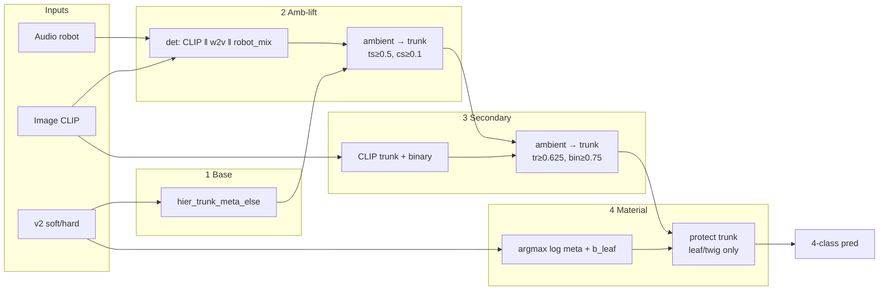

# Clear architecture (claim v2 equivalent)

**Result:** robot Macro F1 **0.8508** (matches sealed `paper_claim_v2`)  
**Code:** `paper_claim/clear_pipeline.py` (~150 lines, one path)

---

## Diagram



### ASCII (paper slide)

```
                    ┌──────────────┐
   audio ──w2v──┐   │ 1) v2 base   │
   audio ──mix──┼──▶│ 2) amb-lift  │──▶ ambient→trunk
   image ──CLIP─┤   │ 3) secondary │──▶ ambient→trunk
                │   │ 4) leaf bias │──▶ leaf/twig only
   v2 soft ─────┘   └──────────────┘
                           │
                           ▼
                      4-class label
```

---

## What was cut (still same F1)

| Cut | Why safe |
|---|---|
| Eff / DINO / ConvNeXt in amb det | agree=1.0 with CLIP-only pack |
| `bandlimit` stress view | agree=1.0 with `robot_mix` alone |
| `do_tt`, multi biases, `T≠1` | already out in v2 |
| hier / v2_rule material soft | meta enough |

## What stays (required)

| Keep | Why |
|---|---|
| v2 base | backbone |
| amb-lift | −amb → 0.82 |
| secondary CLIP | −sec → 0.84 |
| leaf bias protect-trunk | −mat → 0.83; full redecode → 0.81 |
| wav2vec2 | −w2v → 0.73 |
| hand lock / one-shot protocol | purity |

---

## Run

```bash
python run_paper_claim_clear_verify.py
# asserts clear_macro_f1 ≈ sealed 0.8508
```

HPs from `outputs/paper_claim_v2/selection_lock.json` (`b_leaf` hand-selected; not re-tuned here).
