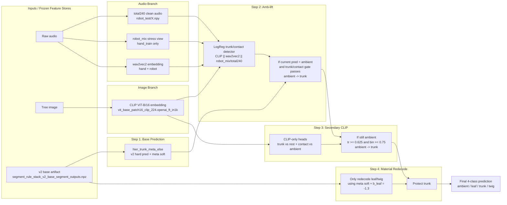

# Multimodal Claim v2 Diagram

**Final sealed result:** `Macro F1 4-class = 0.8507810400` on `robot_test_final`.

This is the paper-facing multimodal/cascade pipeline. It is not an end-to-end joint network. It starts from the v2 base segment predictions, then applies hand-selected cascade fixes using audio and image features.

## Main Diagram



## Compact Slide Version

```text
Audio total240 / robot_mix ─┐
wav2vec2 audio embedding ───┼──► Amb-lift detector ───┐
CLIP image embedding ───────┘                          │
                                                       ▼
v2 base pred + soft meta ─────► ambient→trunk rescue ─► secondary CLIP ─► leaf/twig redecode ─► 4-class label
                               (CLIP+w2v+audio)         (CLIP-only)       (meta + b_leaf)
```

## What Each Part Does

| Part | Input | Model / Rule | Purpose |
|---|---|---|---|
| v2 base | `segment_rule_stack_v2_base_segment_outputs.npz` | `hier_trunk_meta_else` | Initial 4-class segment prediction and meta soft probabilities |
| Audio clean | `total240_trainval_select/features/robot_test/X.npy` | Classical total240 features | Robot-side audio features for detector application |
| robot_mix | `total240_stress_cv_select/stress_features/robot_mix/X.npy` | Deterministic hand stress view | Train detector on robot-like acoustic distortion without robot leakage |
| wav2vec2 | `audio_wav2vec2_features/*` | SSL audio embedding | Adds robust audio representation; removing it collapses F1 to ~0.73 |
| Image CLIP | `image_timm_features/vit_base_patch16_clip_224.openai_ft_in1k` | CLIP ViT-B/16 embedding | Main image branch for amb-lift and secondary trunk/contact heads |
| Amb-lift | `CLIP || wav2vec2 || robot_mix/total240` | Logistic regression trunk/contact heads | Recover trunk windows wrongly predicted as ambient |
| Secondary CLIP | CLIP only | Logistic regression trunk + binary contact heads | Extra ambient-to-trunk rescue; removing it gives ~0.8409 |
| Material redecode | v2 meta soft | `b_leaf = -1.3`, protect trunk | Adjust leaf/twig only while preserving trunk predictions |

## Result Ladder

| Configuration | Meaning | Macro F1 |
|---|---|---:|
| Audio-only paper-safe | No image fusion | `0.7026719928` |
| v2 base | Multimodal base before claim cascade | `0.7966563229` |
| Fusion v2 without secondary CLIP | Ablation: amb-lift + material, no secondary CLIP | `0.8408700631` |
| Full fusion claim v2 | v2 base + amb-lift + secondary CLIP + material redecode | `0.8507810400` |

## Paper-Safe Caption

> Multimodal claim v2 uses a frozen v2 segment base, then applies a hand-selected cascade: an audio-image amb-lift detector using CLIP, wav2vec2, and robot-mix/total240 audio features; a secondary CLIP-only trunk/contact rescue; and a protected leaf/twig material redecode from v2 meta soft probabilities. Robot/test is used only after the selection lock.

